# Chris Sattinger

System Design, Data Engineering and Fullstack development with a focus on climate and sustainability.

I'm currently building sensilla.io — an API SaaS for scraping data and building reactive data pipelines.

I run [Mattermind Labs](https://www.mattermind.com)

Previously:

- [Briink Intelligence](https://briink.com) AI for EU Taxonomy sustainability reporting
- [South Pole](https://www.southpole.com/) GHG Accounting and Carbon Credits platform

## Connect

 

## :zap: Recent Activity

<!--START_SECTION:activity-->
<!--END_SECTION:activity-->

